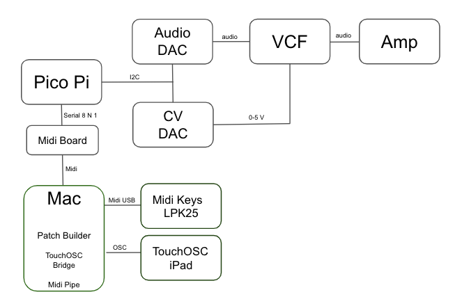
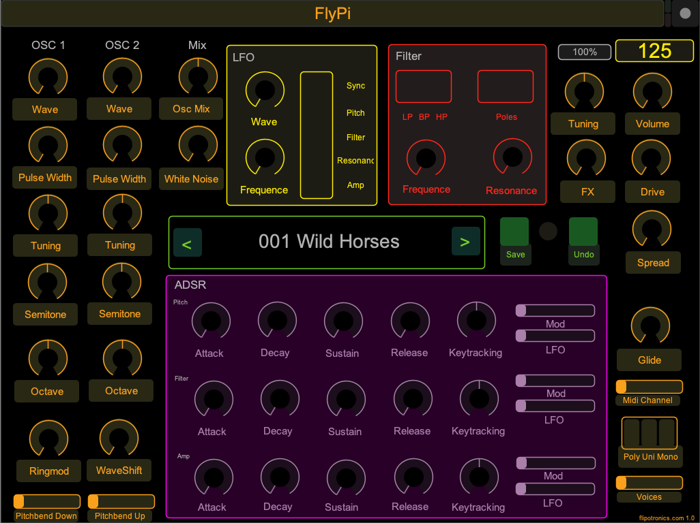

# Fly Pico Pi
Pico Pi based synthesizer

- Digital Oscillator (DCO) using wavetables
- Analog Filter (VCF) control (I use filter in my EuroRack, next i will try to build a filter based on CEM3340:  https://electricdruid.net/cem3320-filter-designs/
- Pico Audio Pack from: https://shop.pimoroni.com/products/pico-audio-pack
- 12 Bit DAC MPC 4725 creates CV control voltage to drive a filter : https://www.adafruit.com/product/935
- Midi Control using Midi Breakout Board: https://www.hobbytronics.co.uk/audio-midi/midi-breakout
- Uses low cost Pico Pi https://www.raspberrypi.org/documentation/rp2040/getting-started/
- Store custom patches on SD card
- Low latency, low jitter, faster than a Linux based system can be
- Hexler Touch OSC UI on IoS:  https://hexler.net/products/touchosc
- Patch Builder on Mac OS

Pico Pi C build environment: https://github.com/raspberrypi/pico-sdk with Visuasl Studio Code

Fritzing Wiring diagram https://fritzing.org/ is coming soon...

